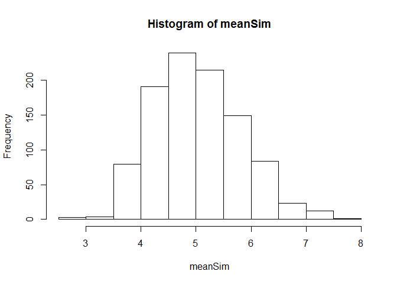
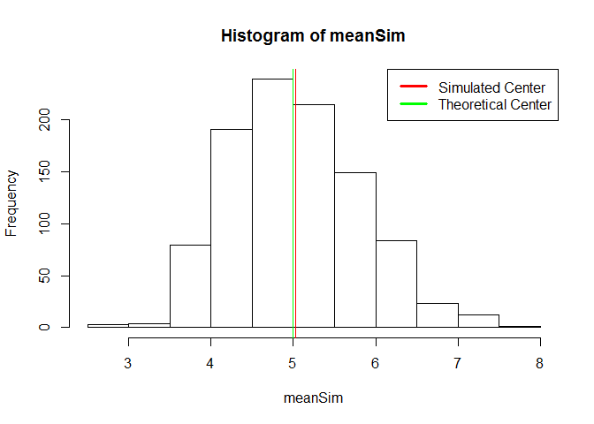
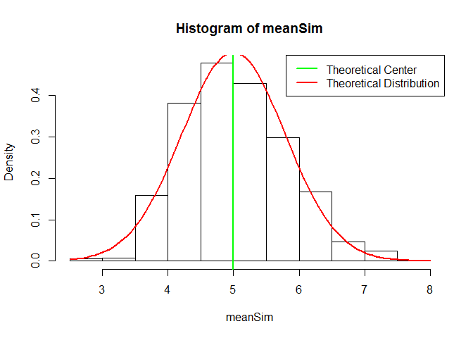

# Statistical Inference Project Part 1
Jacinto  
April 2, 2016  

## Introduction
n this project you will investigate the exponential distribution in R and compare it with the Central Limit Theorem. The exponential distribution can be simulated in R with rexp(n, lambda) where lambda is the rate parameter. The mean of exponential distribution is 1/lambda and the standard deviation is also 1/lambda. Set lambda = 0.2 for all of the simulations. You will investigate the distribution of averages of 40 exponentials. Note that you will need to do a thousand simulations.

## Simulation

```r
set.seed(8080)
n <- 40; y <- .2; m <- 1:1000
meanSim <- sapply(m, function(x){mean(rexp(n,y))})
hist(meanSim)
```



## 1. Show the sample mean and compare it to the theoretical mean of the distribution

```r
## The center based on the model
sim <- mean(meanSim)
```

```r
## Theoretical mean of distribution
actual <- 1/.2
```
The mean of simulation is 5.0278047 and the theoretical mean is 5 and the difference is 0.0278047. As you can see the difference isn't large. The error is 0.5560948%. If larger sample was simulated the error would be smaller, but this is good enough. 


```r
hist(meanSim)
abline(v=sim, col="red", lwd =1)
abline(v=actual, col="green", lwd=1)
legend("topright", c("Simulated Center", "Theoretical Center"), col=c("red", "green"), lwd=3)
```



## 2. Show how variable the sample is (via variance) and compare it to the theoretical variance of the distribution.

```r
sdSim <- sd(meanSim)
varSim <- var(meanSim)
sdActual <- (1/y)/sqrt(40)
varActual <- ((1/y)/sqrt(40))^2
table <- data.frame(StdDev = c(sdSim, sdActual),
                    Variance = c(varSim, varActual),
                    row.names = c("Simulated",
                                  "Theoretical"))

table
```

```
##                StdDev  Variance
## Simulated   0.7841721 0.6149259
## Theoretical 0.7905694 0.6250000
```

```r
## Calculate the difference between them
sdDiff <- sdSim - sdActual
varDiff <- varActual - varSim
```
The difference in standard devivation is -0.0063973 and the variance is 0.0100741. This show that the distribution between the simulated and theoretical are very similar. 

## 3.Show that the distribution is approximately normal.

```r
hist(meanSim, freq = F)
curve(dnorm(x, mean=actual, sd=sdActual), add = TRUE, col="red", lwd=2)
abline(v=actual, col= "green", lwd=2)
legend("topright", c("Theoretical Center", "Theoretical Distribution"), col=c("green", "red"), lwd=2)
```




```r
sessionInfo()
```

```
## R version 3.2.3 (2015-12-10)
## Platform: x86_64-w64-mingw32/x64 (64-bit)
## Running under: Windows 8.1 x64 (build 9600)
## 
## locale:
## [1] LC_COLLATE=English_United States.1252 
## [2] LC_CTYPE=English_United States.1252   
## [3] LC_MONETARY=English_United States.1252
## [4] LC_NUMERIC=C                          
## [5] LC_TIME=English_United States.1252    
## 
## attached base packages:
## [1] stats     graphics  grDevices utils     datasets  methods   base     
## 
## loaded via a namespace (and not attached):
##  [1] magrittr_1.5    formatR_1.3     tools_3.2.3     htmltools_0.3  
##  [5] yaml_2.1.13     stringi_1.0-1   rmarkdown_0.9.5 knitr_1.12.3   
##  [9] stringr_1.0.0   digest_0.6.9    evaluate_0.8.3
```
