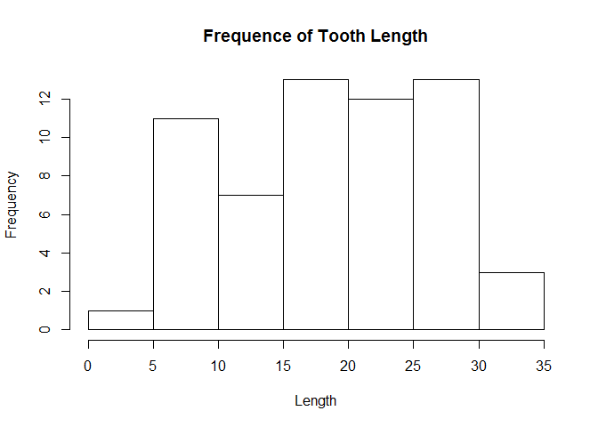
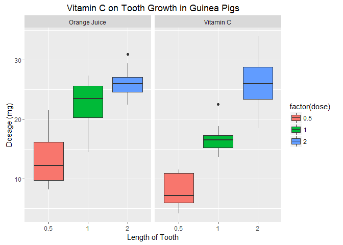

# Tooth Growth Assignment 1 Part 2

## Loading and preprocessing the data

```r
library("datasets")
library("ggplot2")
data("ToothGrowth")
```

## Exploratory Data Analyses

```r
str(ToothGrowth)
```

```
## 'data.frame':	60 obs. of  3 variables:
##  $ len : num  4.2 11.5 7.3 5.8 6.4 10 11.2 11.2 5.2 7 ...
##  $ supp: Factor w/ 2 levels "OJ","VC": 2 2 2 2 2 2 2 2 2 2 ...
##  $ dose: num  0.5 0.5 0.5 0.5 0.5 0.5 0.5 0.5 0.5 0.5 ...
```

```r
summary(ToothGrowth)
```

```
##       len        supp         dose      
##  Min.   : 4.20   OJ:30   Min.   :0.500  
##  1st Qu.:13.07   VC:30   1st Qu.:0.500  
##  Median :19.25           Median :1.000  
##  Mean   :18.81           Mean   :1.167  
##  3rd Qu.:25.27           3rd Qu.:2.000  
##  Max.   :33.90           Max.   :2.000
```

```r
table(ToothGrowth$supp, ToothGrowth$dose)
```

```
##     
##      0.5  1  2
##   OJ  10 10 10
##   VC  10 10 10
```

```r
hist(ToothGrowth$len, xlab = "Length", main= "Frequence of Tooth Length")
```



```r
plot <- ggplot(ToothGrowth,aes(x=factor(dose),y=len,fill=factor(dose)))
labels <- c(OJ = "Orange Juice", VC = "Vitamin C")
plot + geom_boxplot() + facet_grid(.~supp, labeller = labeller(supp = labels)) + xlab("Length of Tooth") + ylab("Dosage (mg)") + ggtitle("Vitamin C on Tooth Growth in Guinea Pigs")
```


## Confidence interval

```r
## Subsetting data based on dose amount
doseHalf <- subset(ToothGrowth, dose == 0.5)
dose1 <- subset(ToothGrowth, dose == 1)
dose2 <- subset(ToothGrowth, dose == 2)
## T.test is performed on the dose amount
doseHalf.t <- t.test(len ~ supp, paired = F, var.equal = F, data=doseHalf)
dose1.t <- t.test(len ~ supp, paired = F, var.equal = F, data=dose1)
dose2.t <- t.test(len ~ supp, paired = F, var.equal = F, data=dose2)
```
Data was subsetted based on the dose amount: 0.5, 1, & 2. And var.equal is assume to be false because based on the explorartory box plot the standard devivation weren't the same. 


```r
## Setting up the confidence interval data frame
interval <- data.frame(p.value = c(doseHalf.t$p.value,
                                   dose1.t$p.value,
                                   dose2.t$p.value),
                       Conf.low = c(doseHalf.t$conf[1],
                                    dose1.t$conf[1],
                                    dose2.t$conf[2]),
                       Conf.high = c(doseHalf.t$conf[2],
                                     dose1.t$conf[2],
                                     dose2.t$conf[2]),
                       row.names=c("doseHalf",
                                   "dose 1",
                                   "dose 2"))
interval
```

```
##              p.value Conf.low Conf.high
## doseHalf 0.006358607 1.719057  8.780943
## dose 1   0.001038376 2.802148  9.057852
## dose 2   0.963851589 3.638070  3.638070
```


## Conclusion
Based on the interval table, it showed that orange juice is more effective at lower dosage than vitamin c. However, the effective less becomes the same as the dosage increase. So at lower dosage, orange juice is a better choice. So the most important factor is dose and not the source. Assumption made is that the experiment done in a randomized way and the sample is representative of the population being sampled. And there were no biased introduced to the experiment. 


```r
sessionInfo()
```

```
## R version 3.2.3 (2015-12-10)
## Platform: x86_64-w64-mingw32/x64 (64-bit)
## Running under: Windows 8.1 x64 (build 9600)
## 
## locale:
## [1] LC_COLLATE=English_United States.1252 
## [2] LC_CTYPE=English_United States.1252   
## [3] LC_MONETARY=English_United States.1252
## [4] LC_NUMERIC=C                          
## [5] LC_TIME=English_United States.1252    
## 
## attached base packages:
## [1] stats     graphics  grDevices utils     datasets  methods   base     
## 
## other attached packages:
## [1] ggplot2_2.0.0
## 
## loaded via a namespace (and not attached):
##  [1] Rcpp_0.12.3      digest_0.6.9     grid_3.2.3       plyr_1.8.3      
##  [5] gtable_0.1.2     magrittr_1.5     evaluate_0.8.3   scales_0.3.0    
##  [9] stringi_1.0-1    reshape2_1.4.1   rmarkdown_0.9.5  labeling_0.3    
## [13] tools_3.2.3      stringr_1.0.0    munsell_0.4.3    yaml_2.1.13     
## [17] colorspace_1.2-6 htmltools_0.3    knitr_1.12.3
```
